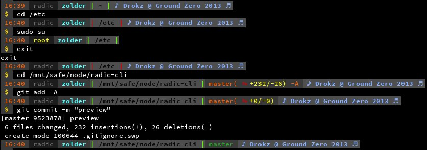
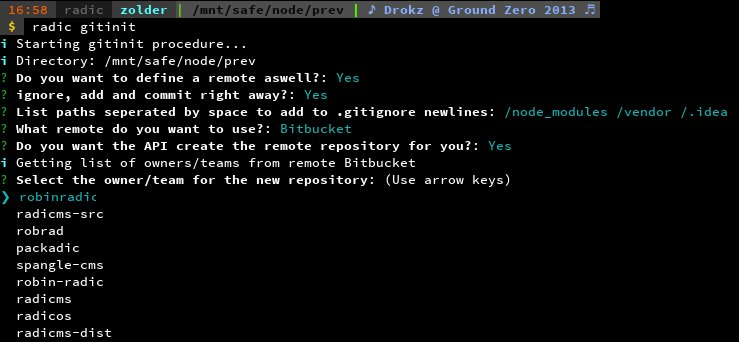
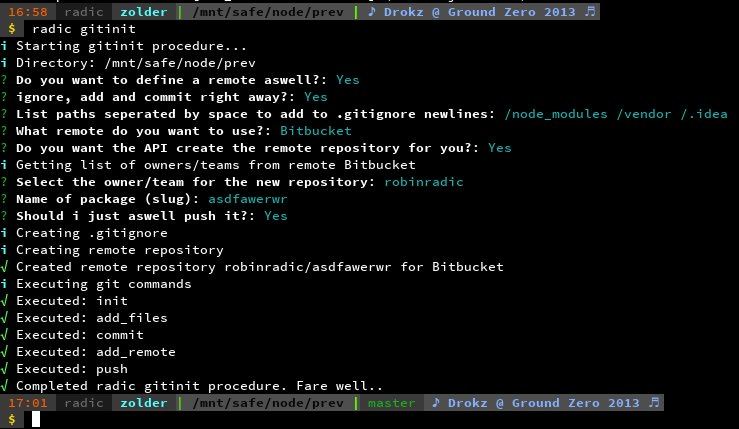

- Current version: ` 0.0.1 `
- Status: **under development**
- License: [MIT Licensed](http://radic.mit-license.org)
- Copyright 2014 [Robin Radic](https://github.com/RobinRadic)
- Platform: **Linux** but might run on a crapple, not tested yet. 

## Description
radic-cli is a NodeJS module that can be embedded into other projects to handle command line input/output. 
It consists out of several other modules and brings them together, **the way i want it**. The main focus i have is user interaction like wizards and cli UIs. 

So yeah, this is a highly opinionated library. However, it features a plugin like system to extend core functionality, or even extend/alter other plugins.

radic-cli features a stand-alone application next to the embeddable features. The stand alone application can be invoked by the command `radic-cli` and will give you an overview of possible commands.

## Overview of main features

#### Bash PS1 and PS2 prompt

$ radic-cli ps1

Adds a custom ps1 and ps2 prompt to bash. Makes use of the [liquidprompt](https://github.com/nojhan/liquidprompt) library internally. It's also possible to export the theme so you can modify it to suit your needs.

#### Wizards
An example of what can be created. The preview shows `radic gitinit` from my [radic](http://npmjs.org/package/radic) tool, which utilizes radic-cli.

#### UI's
Fast and painless UI creation with using blessed in the background. It uses pre-defined theme's, styles and widgets to quickly display content. Custom theme/style/widgets creation is supported and are able to inherit/extend from others. 

## Command line commands
Note: most of these commands are also embeddable into other projects
#### version

$ radic-cli version             # Shows the version string from package.json
> 1.3.15

# Show a part of the version string
# radic-cli version previous|current|next major|minor|patch
$ radic-cli version current major 
> 1

$ radic-cli version next major
> 2


#### config

$ radic-cli config set my:breakfast "pizza"
$ radic-cli config get my:breakfast
> pizza

$ radic-cli config set my:dinner '{ "main-course": "apples", "desert": { "first": "ice", "then": "strawberry" }, "snacks": ['mars', 'twix'], "full-stomach": true }' --json
$ radic-cli config get my:dinner:main-course
> apples

$ radic-cli config get my:dinner:snacks:1
> twix

$ radic-cli config get my

json
{
    "breakfast": "pizza",
    "dinner": { 
        "main-course": "apples", 
        "desert": { 
            "first": "ice", 
            "then": "strawberry" 
        }, 
        "snacks": ['mars', 'twix'],
        "full-stomach": true 
    }
}


## Embedding into projects
For a use-case example, check out [radic](http://npmjs.org/packages/radic) or [radic-restcms](http://npmjs.org/packages/radic).

Or check out [radic-cli examples](https://npmjs.org/packages/radic-cli-examples) for several different implementation examples.

#### Embedding the cli
This is an example directory/file structure, you can put your stuff wherever yo want.
js
// bin/myappcmd
process.title = 'myapp';
var myapp = require('../index.js');

// index.js
return module.exports = require('./lib');

// lib/index.js
var RadicCli = require('radic-cli');

var Cli = RadicCli.Cli;
var pkg = require('../package.json');

var myapp = {
    name: pkg.name,
    author: pkg.author,
    version: pkg.version,
    description: pkg.description
}

myapp.cli: Cli(myapp.name)


##### Tools and methods
js
var RadicCli = require('radic-cli'),
    Cli = RadicCli.Cli,
    Config = RadicCli.Config,
    utils = RadicCli.utils;
    
utils.ucfirst('working is a drag') //> Working is a drag



## Credits
- **radic-cli**: Robin Radic
- **async**: ..
- **blessed**: ..
- **celeri**: ..
- **cli**: ..
- **cli-color**: ..
- **cli-table**: ..
- **fs-extra**: ..
- **inquirer**: ..
- **moment**: ..
- **nconf**: ..
- **underscore**: ..
